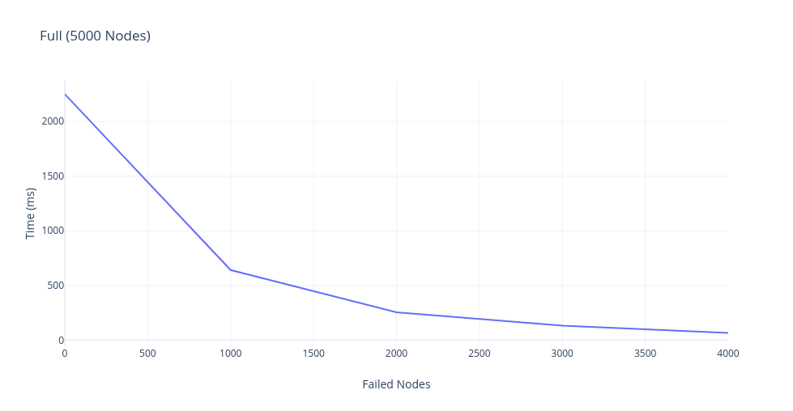
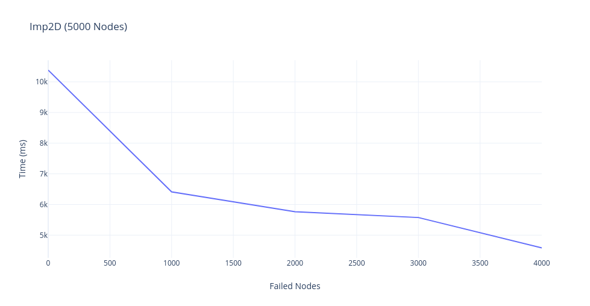
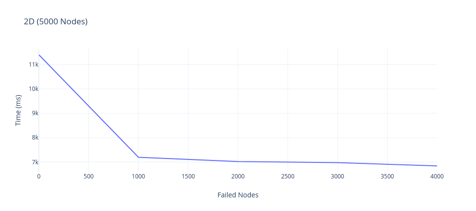

<h1 align="center"> Project Report </h1>  

## Table of Contents

- [Table of Contents](#table-of-contents)
- [Build Process](#build-process)
- [Bonus](#bonus)
  - [Full](#full)
  - [Imp2D](#imp2d)
  - [2D](#2d)
  - [Line](#line)

## Build Process

- unzip the compressed file using `unzip filename.zip`
- `dotnet fsi --langversion:preview proj2.fsx nodeNum topology protocol failedNodes` to run script where `nodeNum` is the number of nodes you want to run topology for. `topology` can have values in [`line`, `full`, `2D`, `Imp2D`]. The protocol can have values either `gossip` or `push-sum`. `failedNodes` is the number of random nodes that needs to be failed within a network.

## Bonus

We have added failure mechanism that accepts `failedNodes` as input parameter. We randomly designate some nodes as failure nodes and these nodes do not transmit data to neigboring nodes.

After implementation of failure model, the network failed to converge in push sum model. This is because failed nodes acts a dead zone and does not transmit any message to future neigboring nodes.

In order to tackle this problem, we made use of `ActorConverger` that sends messages to random non-converged node and keeps the converging process going on. After this implementation, we have observed that upon adding failure nodes, the network tries to converge much faster compared to network with 0 failure node. This is due the fact that there are lesser number of nodes to converge and hence the time require to converge whole network is smaller.

We have tried running the above algorithm on Full Network with 5000 nodes and here the result:

### Full

### Imp2D

### 2D

### Line

It is clear that the time it takes to converge reduces drastically with the increase in number of failure nodes.
